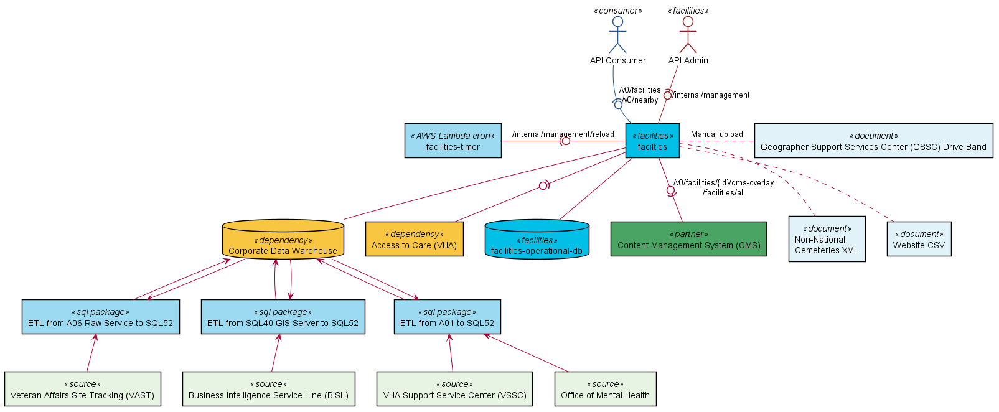

# lighthouse-facilities

The Lighthouse Facilities API provides information about physical VA facilities, including
location, address, phone, hours of operation, and available services.

The API is composed of two [Spring Boot](https://spring.io/projects/spring-boot)
applications: [facilities-collector](facilities-collector/README.md) and
[facilities](facilities/README.md).
(Other modules include
[facilities-api](facilities-api/README.md) for the API models,
[facilities-mock-services](facilities-mock-services/README.md) and
[facilities-local-db](facilities-local-db/README.md) for local development, and
[facilities-tests](facilities-tests/README.md)
for integration testing.)

For details about available endpoints and interactions, refer to the
OpenAPI documentation on the
[Lighthouse Developer Portal](https://developer.va.gov/explore/facilities/docs/facilities).

# System Components

### What's going on?
* `facilities` is the primary application responsible for serving Facilities API requests.
  Requests are served against an operational database.
* `facilities-collector` is responsible for gathering most facilities data and creating a
  uniform representation.
* `facilities-operational-db` is used to maintain _ready to serve_ representations of
  facilities, operating status, and drive time band data. Facility data is updated nightly
  through the facilities collection process.
  Operating status may be updated at any time by CMS.
  Drive time band data is currently refreshed on an as-needed basis.
* `facilities-timer` is a Kubernetes Cron pod that fires nightly to trigger the facilities
  collection/data reload process.
* `Access to Care` and `ArcGIS` are services used to provide different aspects
  of facilities. This data is aggregated by the `facility-collector`.
* `Cemetery XML` is an externally-maintained document
  that provides information about state cemeteries that are not managed by the VA.
  This data is aggregated by the `facility-collector`.
* `Website CSV` is a document maintained in this repository that is used
  to augment the data available from _live_ sources.
* `Corporate Data Warehouse` undergoes a nightly ETL process to transfer
  health facilities, stop codes, and mental health phone numbers
  from the _A01_ server to the _SQL52_ server where it is consumed by the
  `facilities-collector`.
* `PSSG Drive Band` documents are currently being used in place of the the PSSG Drive Time Bands
  service which is offline. This data has been extracted from the last successful PSSG collection
  process and manually uploaded to the `facilities` application through management APIs.

# Data Flow

### What's going on?
* `facilities-collector` aggregates data from other services, databases, or manually managed
  files. Drive time band and operating status are not collected by the `facilities-collector`.
  Collection is an expensive process that is performed periodically.
* `CMS` is both a consumer and a producer of information. `CMS` will periodically pull all
  facilities to automatically populate content pages in Drupal.
  Additionally, regional administrators of CMS data, may change the operating status at any time.
  This information is provided back to the Facilities API through a specialized CMS-dedicated
  endpoint. Operating status is stored in the operational database along side facility data.

# Local Development

Refer to [health-apis-parent](https://github.com/department-of-veterans-affairs/health-apis-parent)
for basic environment setup. (Java, Maven, Docker, etc.)
Execute `mvn clean install` to build all of the modules, then follow the local development
instructions for [mock-services](facilities-mock-services/README.md#local-development),
[local-db](facilities-local-db/README.md#local-development),
[facilities-collector](facilities-collector/README.md#local-development),
and [facilities](facilities/README.md#local-development).
